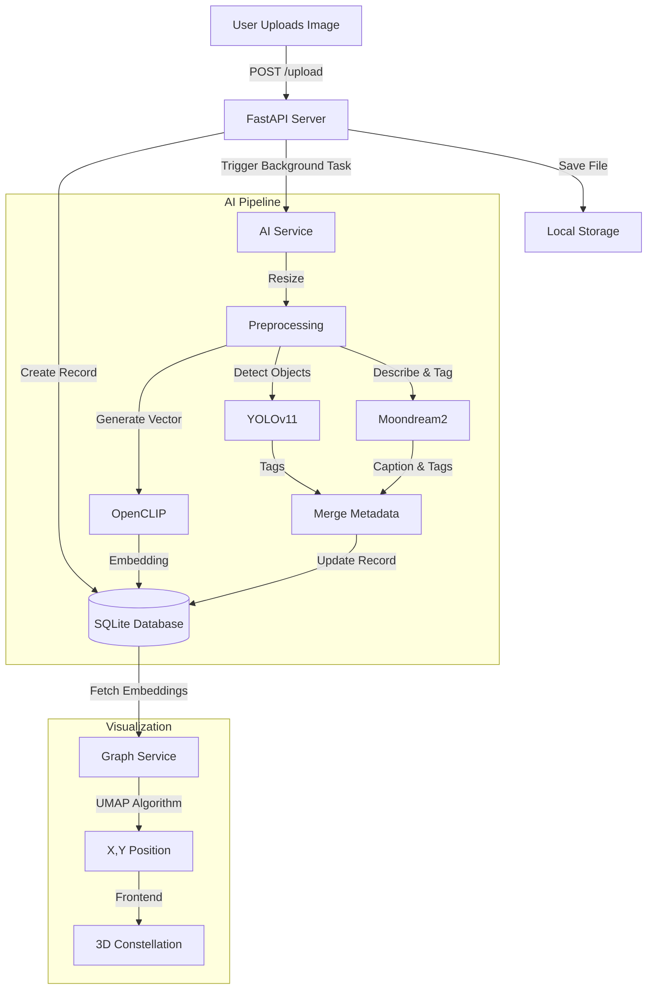

# Image Processing Pipeline Explained

This document details the complete journey of an image in the **Eye** project, from the moment it is uploaded to its final placement in the 3D constellation graph.

---

## 1. Image Entry (Upload)
**Endpoint:** `POST /upload`
**Code:** `backend/app/api/routers/documents.py`

1.  **Validation**: The server first checks if the uploaded file has a valid image extension (`.jpg`, `.png`, `.webp`, etc.).
2.  **Storage**: The file is saved to the local disk in the `data/` directory.
3.  **Database Entry**: A new record is created in the SQLite database with:
    *   `filename`: Original name of the file.
    *   `relative_path`: Path to the stored file.
    *   `processing_progress`: Set to `0` (Starts the frontend progress bar).
4.  **Async Handoff**: The server immediately returns a "Upload successful" response to the user while triggering the `process_document_ai_async` function in the background.

---

## 2. AI Processing Pipeline
**Service:** `backend/app/services/ai_service.py`
**Worker:** `process_document_ai`

This pipeline runs asynchronously to ensure the UI remains responsive.

### Step A: Preprocessing (Progress: 10% → 20%)
*   **Resize**: Large images are resized to a maximum dimension of **1024px** using high-quality LANCZOS resampling. This ensures faster AI inference without significant loss of detail.

### Step B: Object Detection with YOLO (Progress: 20% → 40%)
*   **Model**: **YOLOv11m** (Medium).
*   **Action**: The image is passed through YOLO to detect common objects (e.g., "person", "dog", "car", "laptop").
*   **Optimization**: Inference uses **FP16** (half-precision) and a fixed size of **640px** for speed on Apple Silicon (MPS).
*   **Result**: A list of high-confidence object tags (e.g., `['cat', 'sofa']`).

### Step C: Visual Understanding with Moondream (Progress: 40% → 80%)
*   **Model**: **Moondream2** (A lightweight Visual Language Model).
*   **Action**: The model "looks" at the image and answers a structured prompt.
*   **Prompt**: 
    > "Provide two things: 1. A 2-sentence description... 2. List the 5 most important objects... Format your response as: DESCRIPTION: [text] TAGS: [tag1, tag2...]"
*   **Result**: 
    *   **Caption**: A natural language description (e.g., "A golden retriever sitting on a park bench during sunset.").
    *   **AI Keywords**: Abstract concepts or objects YOLO might miss (e.g., "sunset", "happiness", "outdoors").

### Step D: Embedding Generation with CLIP
*   **Model**: **OpenCLIP (ViT-B-32)**.
*   **Action**: The image is converted into a **512-dimensional vector** (a list of 512 numbers).
*   **Significance**: This vector represents the "semantic meaning" of the image. Images with similar content (e.g., two different photos of beaches) will have mathematically similar vectors.

### Step E: Finalization (Progress: 100%)
*   **Merge**: Tags from YOLO and Moondream are combined and deduplicated.
*   **Save**: The following are saved to the database:
    *   `tags`: Combined list (max 15).
    *   `caption`: The descriptive text.
    *   `embedding`: The 512-dim vector.
    *   `processing_progress`: Set to `100`.

---

## 3. The Constellation Graph (Placement & Linking)
**Endpoint:** `GET /graph`
**Service:** `backend/app/services/graph_service.py`

How does the system decide where an image goes?

### A. Positioning (UMAP Projection)
1.  **Input**: The system takes the **512-dimensional embeddings** of all images in the database.
2.  **Dimensionality Reduction**: It uses **UMAP** (Uniform Manifold Approximation and Projection) to squash these 512 dimensions down to just **2 dimensions (X, Y)**.
3.  **Cluster Logic**: UMAP preserves local structure. If Image A and Image B are semantically similar (their vectors are close), UMAP places them close together on the 2D plane.
4.  **Normalization**: The X/Y coordinates are scaled to a user-friendly range (0-1000) for the frontend canvas.

### B. Linking (Connections)
*   **Logic**: The system checks every pair of images.
*   **Rule**: If two images share **3 or more tags**, a "link" line is drawn between them.
*   **Effect**: This creates visual clusters of related concepts (e.g., a web of "cars", connected to "vehicles", connected to "street").

---

## Summary Flowchart

